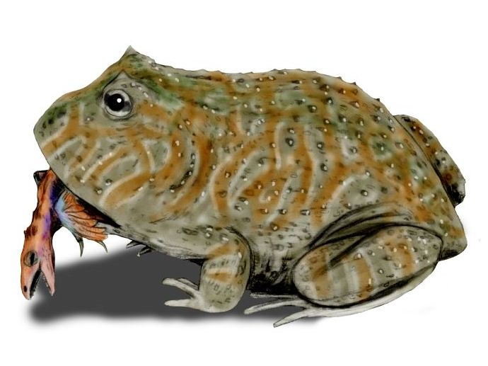

 

Beelzebufo ampinga by Nobu Tamura (http://spinops.blogspot.com) (Own work). [GFDL](http://www.gnu.org/copyleft/fdl.html) or [CC BY 3.0](http://creativecommons.org/licenses/by/3.0), via Wikimedia Commons

------

"Most amphibia are abhorrent because of their cold body, pale colour, cartilaginous skeleton, filthy skin, fierce aspect, calculating eye, offensive smell, harsh voice, squalid habitation, and terrible venom; and so their Creator has not exerted his powers (to make) them many of them," (Linnaeus 1758)

# Why study amphibians?

# Some things about extinction risk

