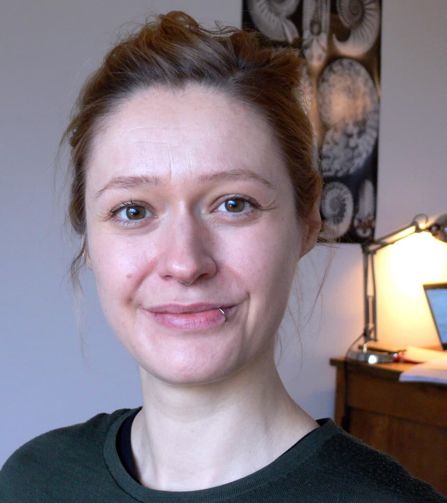

---
output:
  html_document:
    toc: no
    toc_depth: 2
    toc_float: yes
---


<div style="width:250px; height=1500px">
 
</div>

<a href="https://github.com/Eryops1">
    
</a>
<a href="https://www.researchgate.net/profile/Melanie_Tietje">
    
</a>
<a href="https://publons.com/author/1629562/melanie-tietje#profile">
    
</a>
<a href="https://orcid.org/0000-0003-1157-2963">
    
</a>
<!-- <a href="https://pure.au.dk/portal/en/persons/melanie-tietje(6abaa223-a82b-4577-acce-f2ead58ba86b).html"> -->
<!--      -->
<!-- </a> -->


\\
The safest bet to reach me is still by E-mail: \
tietje[AT]fzp.czu.cz

-----

<!-- # Former labs -->

<!-- * **The Plant Evolution and Biodiversity Group**\ -->
<!-- My former lab at [Aarhus University](https://bio.au.dk/en/research/research-areas/genetics-and-evolution/plant-evolution-and-biodiversity) in Aarhus, Denmark. During my postdoc there I worked on questions about the diversity and evolution of plants, criss-crossing several fields including phylogenetics, macroevolution, comparative biology, biogeography, macroecology, and taxonomy. -->

<!-- * **The herpetology lab at Natural History Museum Berlin**\ -->
<!-- My former [lab](https://www.researchgate.net/lab/Mark-Oliver-Roedel-Lab)  at the Museum for Natural History in Berlin. I did my PhD here. -->
<!-- Frog experts, snake enthusiasts and allround ecologists. \ -->
<!-- <a href="https://www.naturkundemuseum.berlin/en/einblicke/mitarbeiter/melanie.tietje"> -->
<!--      -->
<!-- </a> -->


<!-- ### Erick Lundgren -->
<!-- https://ejlundgren.github.io/ -->

<!-- ### Martin Schobben -->

<!-- [Geobiologist](https://martinschobben.github.io/webpage/index.html). He works on the interaction of organisms with their environment, the large biogeochemical cycles and climate, during pivotal periods in the Earths’ history. Developing methodological strategies to reliably read geochemical proxies in terms of the recorded physical and chemical parameters. Has his own R-package: [POINT](https://martinschobben.github.io/point/) -->

<!-- <!-- ### Richard Hofmann -->

<!-- <!-- [Palaeontologist at Museum für Naturkunde Berlin](http://www.fossilrich.com/), Germany. He is interested in fundamental transformations (i.e. mass extinctions, recovery episodes, radiations, and ecological innovation). -->

<!-- ### Johan Renaudie -->

<!-- [Micropaleontologist at Museum für Naturkunde Berlin](https://plannapus.github.io/), Germany. Studies Cenozoic siliceous plankton and their relationship with past climatic and oceanographic changes, and my R-hero. -->


<!-- # Comments  -->
<!-- Leave a comment on this page! -->
<!-- ```{r, echo=FALSE} -->
<!-- # this html includes disqus -->
<!-- #htmltools::includeHTML("_layouts/disqus.html") -->

<!-- # this includes the html comment box -->
<!-- htmltools::includeHTML("_layouts/post.html") -->

<!-- ``` -->