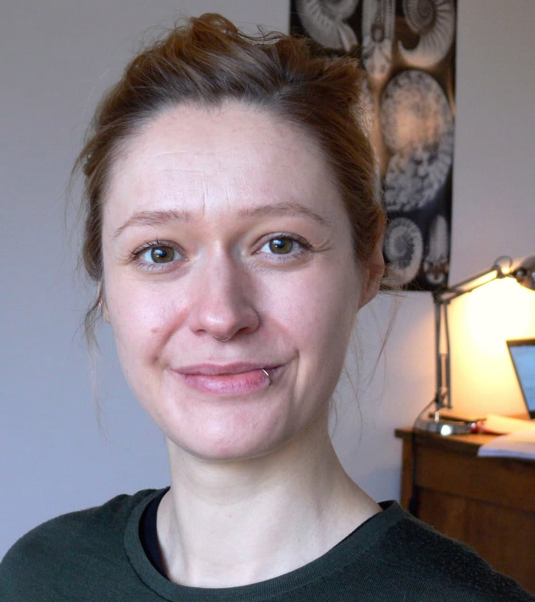

  

 

<h1>Affiliation</h1>

Postdoctoral Researcher 
MOBI lab 
Faculty of Environmental Sciences 
Czech University of Life Sciences Prague 
Prague, Czech Republic

<h1>Academic qualifications</h1>

2018 — Dr.rer. nat., Humboldt University of Berlin 
2011 — MSc in Organismic Biology and Evolution, Humboldt University of Berlin

<h1>Contact</h1>

 &nbsp; &nbsp;
<b>tietje[AT]fzp.czu.cz</b>

