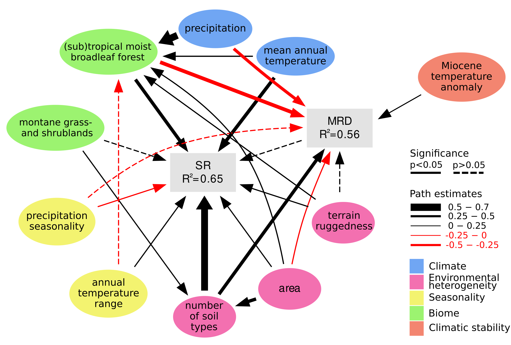

<!-- 

 -->

<!--   -->

<!-- 
 -->
<!--    -->
<!--    -->
<!--   News -> -->
<!--    -->
<!--   Fresh paper on [Plant Phylogenetic diversity hotspots](https://doi.org/10.1111/nph.19151) -->
<!--    -->
<!-- 
 -->

</head>
<body>

<!-- 
 -->

<!--   
 -->

<!--   <!-- 
 --> 

<!-- 
 -->
<!-- <a href = "https://doi.org/10.1073/pnas.2120662119"> -->
<!--    -->
<!--       <!-- 
 --> 
<!--           Tietje et al. 2022, PNAS -->
<!-- </a> -->
<!-- 
 -->

<!-- 
 -->

<!--   
 -->

<!--    -->

<!-- 
 -->
<!--    -->
<!--    -->
<!--    -->
<!--   Check out our new publication on drivers of global vascular plant diversity and diversification patterns! -->
<!--   [PNAS]("https://doi.org/10.1073/pnas.2120662119") -->
<!--    -->
<!-- 
 -->

<!--   
 -->

<!-- 
 -->

<!--     -->

  
  

  
 About me  
 
   I'm a quantitative ecologist interested in all kinds of (macro-)ecological topics and patterns. Currently my home is the Center for Biodiversity at [Temple University](http://www.hedgeslab.org/people.php) in Philadelphia.

  I have worked on deep time paleontological and neontological topics, including extinction risk factors (and climatic effects on them) in invertebrates and amphibians, geographic range size patterns, diversity, and macroevolutionary questions regarding the assembly of tropical rainforests. 
  
  When I am not working I love to work on bikes, brew beer, watch sci-fi and cartoons and if there is still time go camping in the desert. 

  

  
  

  

------

