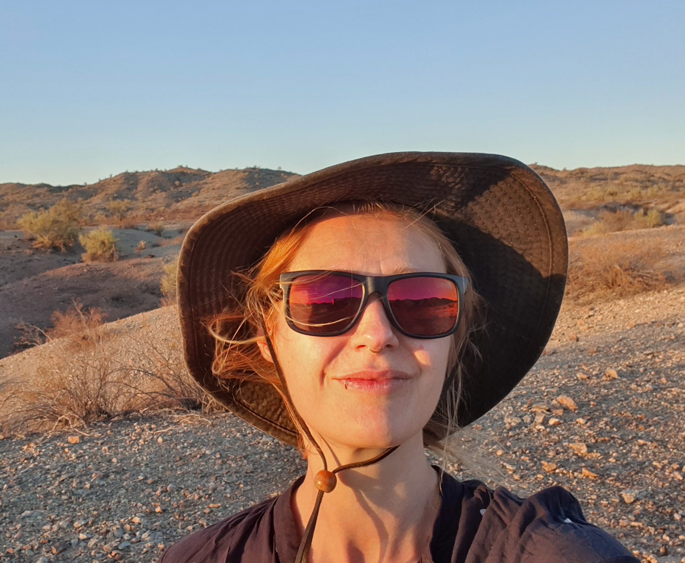

  

Hi! 

I'm a quantitative ecologist interested in macroecological and -evolutionary topics. I am currently a Postdoctoral Researcher at the CZU in Prague, working in [MOBI Lab](https://petrkeil.github.io/) on different aspects of biodiversity change across space and time.

In the past I have worked on both deep time paleontological and neontological topics; extinction risk factors (and climatic effects on them) in invertebrates and amphibians, geographic range size patterns, diversity and diversification patterns and connections.

In my free time I love to work on bikes, brew beer, climb, watch sci-fi and, if possible, spend time in the desert.

 

