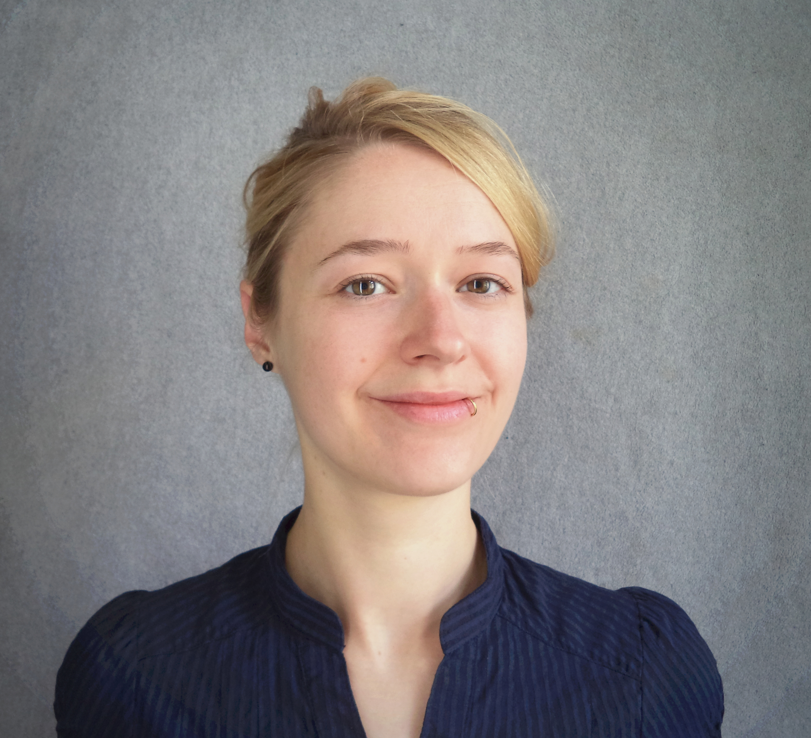

I am Melanie Tietje, a biologist at the [Natural History Museum in Berlin](https://www.naturkundemuseum.berlin/en/einblicke/mitarbeiter/melanie.tietje), Germany. In my PhD project I work on traits that influence extinction risk in fossil and modern amphibian species.

 

------

This website is part of a project I am working on as a fellow in the [Open Science Fellow Program](https://wikimedia.de/wiki/Fellowprogramm). I am a fellow in the program since September 2016, since then I am exploring different aspects of open science like community feedback in data analysis and publication. 

All work on this page is in progress.

------

