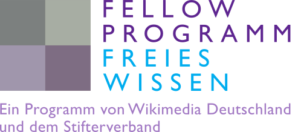

I am Melanie Tietje, a biologist working at the [Natural History Museum in Berlin](https://www.naturkundemuseum.berlin/en/einblicke/mitarbeiter/melanie.tietje), Germany. In my PhD project I work on traits that influence extinction risk in fossil and modern amphibian species.

 

------

Besides bridging the gap between the fossil record and current biology in my PhD work, I am interested in different concepts of Open Science. This website was initialized as part of my work as a fellow in the [Open Science Fellow Program](https://wikimedia.de/wiki/Fellowprogramm). Launched for the first time in 2016 by Wikimedia Germany and Stifterverband the fellow program enables 10 scientists from different aereas to open up their research by providing guidance and financial support. 

 

------

