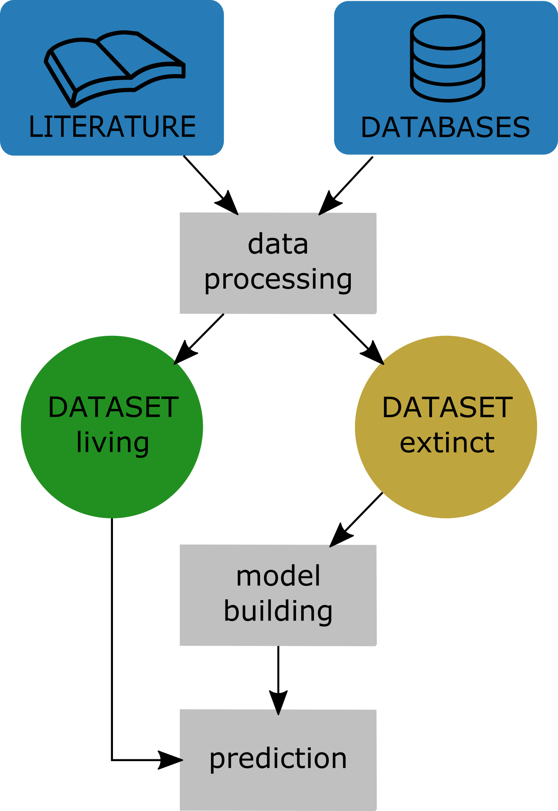
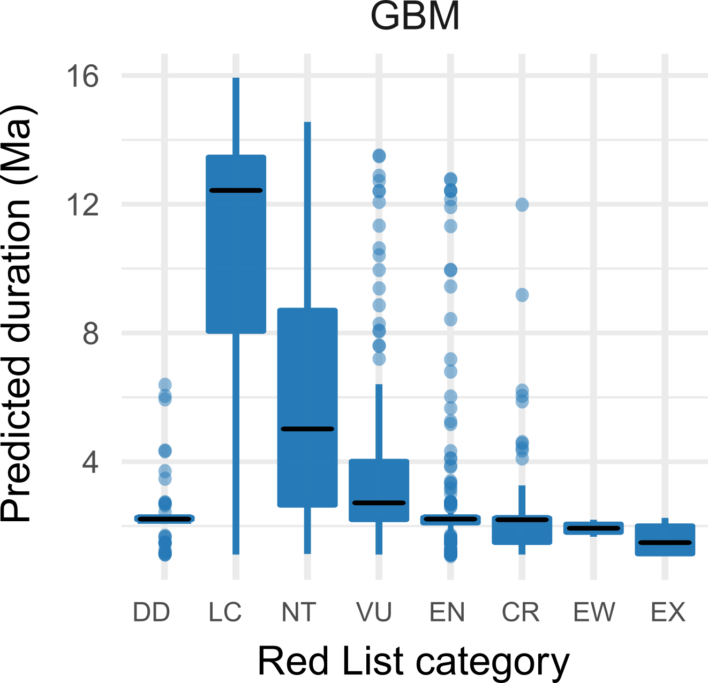

---
output:
  html_document:
    toc: yes
    toc_depth: 2
    toc_float: yes
---

# Ongoing

## Explaining tropical hyperdiversity

In this project we ask the quite fundamental question why there are so many species in tropical rainforest.
Tropical rainforests are widely regarded to harbour about half of the world's terrestrial species, despite covering less than 10% of the world's land surface. These numbers are not precise for various reasons, but it is clear that tropical rainforests are outstandingly ("hyper"-)diverse. [more info](https://peb-group.net/trf)

----------------------------------------

# Completed

## Temporal patterns in extinction risk factors and climate in the amphibian fossil record
In the coming decades we might face the loss of more than 50\% of the climatic ranges for more than 
half  of  plants  and  34\%  of  animals  [1].  Abrupt  greenhouse driven  climate  change  and  synergistic 
effects,  e.g. d isrupted  migration  pathways  and  breeding  cycles,  changing  predator,  competitor  and 
prey  relations,  habitatloss  as  well  as  diseases,  are  significant  contributors  to  this  biodiversity 
destruction.  Although  often  ignored  from  a  public  perspective,  or  considered  to  be  of  lesser 
importance  than  likeable  flagship  species,  amphibians  alongside  reptiles  might  face  greatest 
extinction risk under current changing climate [2].

This project aims at connecting changing climatic conditions and temporal trends in amphibian 
traits, including extinction risk and diversity, to  expand  our  knowledge  about  current  and  future  extinction  threats to amphibians. The project uses oxygen isotope data to reconstruct the relative temperature changes as well as latitudinal temperature gradients.

### Results
When connecting a continuous measure for the correlation of geographic range and duration of species, we find that this correlation is fluctuating over time, and strongly connected to the latitudinal relative temperature gradient. Our results suggest that climatic conditions influence the importance of geogrpahic range on extinction risk for amphibians.
The results are published in Paleo3 [3].

### Literature

1. Warren, R., et al. "Quantifying the benefit of early climate change mitigation in avoiding biodiversity loss." 
Nature Climate Change 3.7 (2013): 678‐682. 
2. Stuart, S. N., et al. "Status and trends of amphibian declines and extinctions worldwide." Science 306.5702 
(2004): 1783‐1786. 
3. Tietje, M., Rödel, M.-O., Schobben, M. (in press). The effect of geographic range and climate on extinction risk in the deep-time amphibian fossil record. Palaeogeography, Palaeoclimatology, Palaeoecology. [link](https://doi.org/10.1016/j.palaeo.2019.109414)

 

---------------------------------------------------

## Extinction risk in fossil and living amphibians
### Background

Amphibians are the most endangered terrestrial vertebrate group [1]. Several studies examined biological, environmental and also anthropogenic factors that can potentially add to extinction risk [2]. Typical influential factors are the geographic range size and bodysize of a species, which have been confirmed in studies on fossils from extinct species as well [3].

Although amphibians are one of the most threatened groups today, their fossil record and the recorded extinction events of amphibians are usually not taken into account. As the fossil record invites to study plenty of real extinction events, it can provide valuable information about factors influencing a species survival.

### Results
We were able to show in a unique combination of fossil and neontological data how the fossil can actually predict the extinction risk of living species. The results are published in Ecology Letters [4].

 

Model framework for the study. [Tietje, M. and Rödel, M. O. (2018), figure 1](https://doi.org/10.1111/ele.13080).

We used generalised boosted modelling to analyse the impact of several traits that are assumed to influence extinction risk on the stratigraphic duration of amphibian species in the fossil record. We used this fossil calibrated model to predict the extinction risk for living species. We observed a high consensus between our predicted species durations and the current IUCN Red List status of living amphibian species. We also found that today's Data Deficient species are mainly predicted to experience short durations, hinting at their likely high threat status. Our study suggests that the fossil record can be a suitable tool for the evaluation of current taxa specific Red Listing status. 

 

Predicted durations in million years for living amphibian species, based on the model fitted with paleontological data. [Tietje, M. and Rödel, M. O. (2018), figure 3](https://doi.org/10.1111/ele.13080).

### Literature
1. Baillie, J. E. M., Griffiths, J., Turvey, S. T., Loh, J. & Collen, B. 2010 Evolution Lost: Status and Trends of the World’s Vertebrates. Zoological Society of London. 
2. Sodhi, N. S., Bickford, D., Diesmos, A. C., Lee, T. M., Koh, L. P., Brook, B. W., Sekercioglu, C. H. & Bradshaw, C. J. A. 2008 Measuring the meltdown: drivers of global amphibian extinction and decline. PLoS One 3, e1636. (doi:10.1371/journal.pone.0001636)
3. Harnik, P. G. 2011 Direct and indirect effects of biological factors on extinction risk in fossil bivalves. Proc. Natl. Acad. Sci. U. S. A. 108, 13594–13599. (doi:10.1073/pnas.1100572108)
4. Tietje, M. and Rödel, M. O. (2018), Evaluating the predicted extinction risk of living amphibian species with the fossil record. Ecology Letters. [doi:10.1111/ele.13080](https://doi.org/10.1111/ele.13080)

