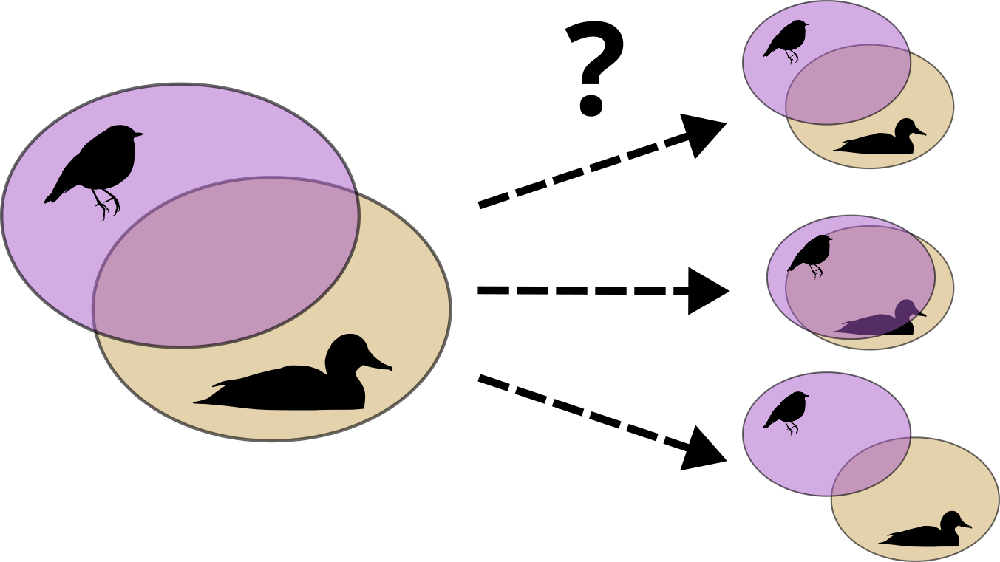
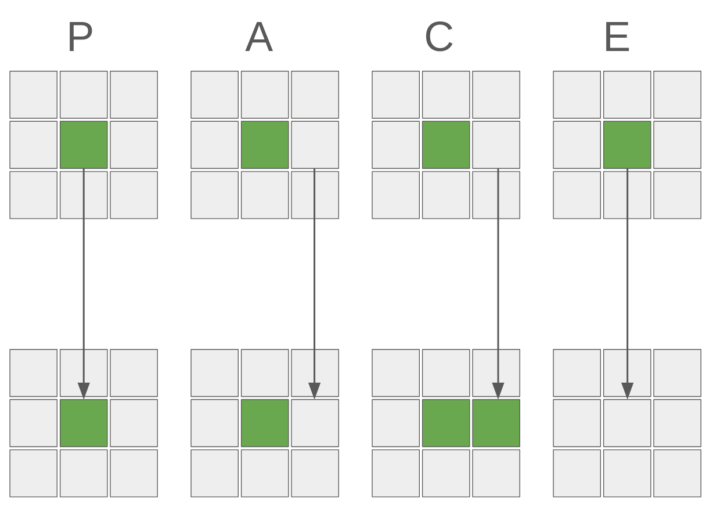
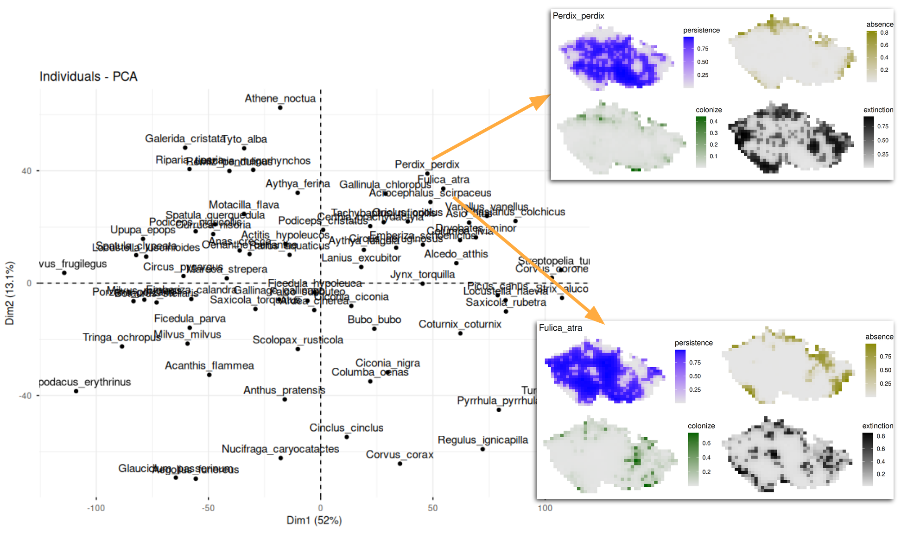
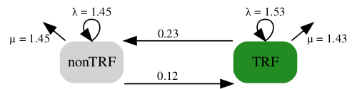
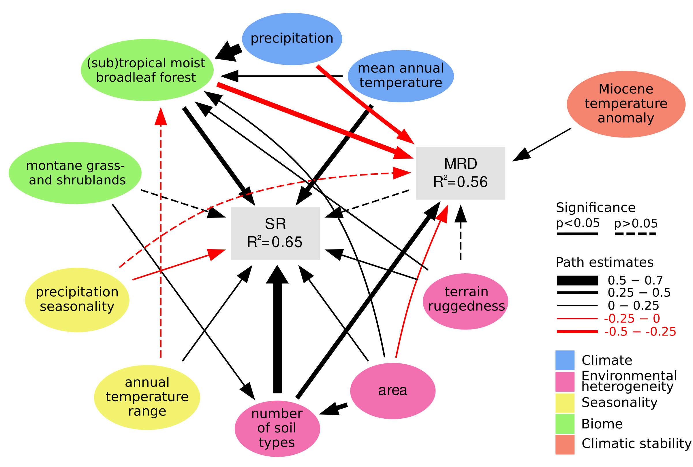
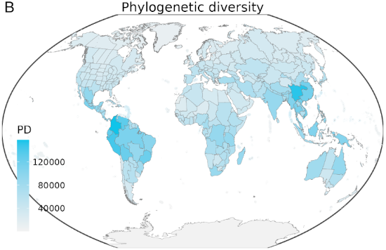
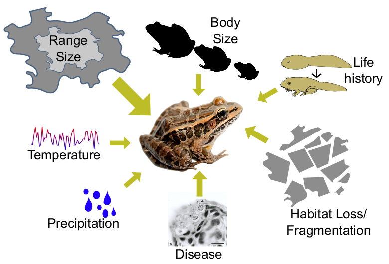
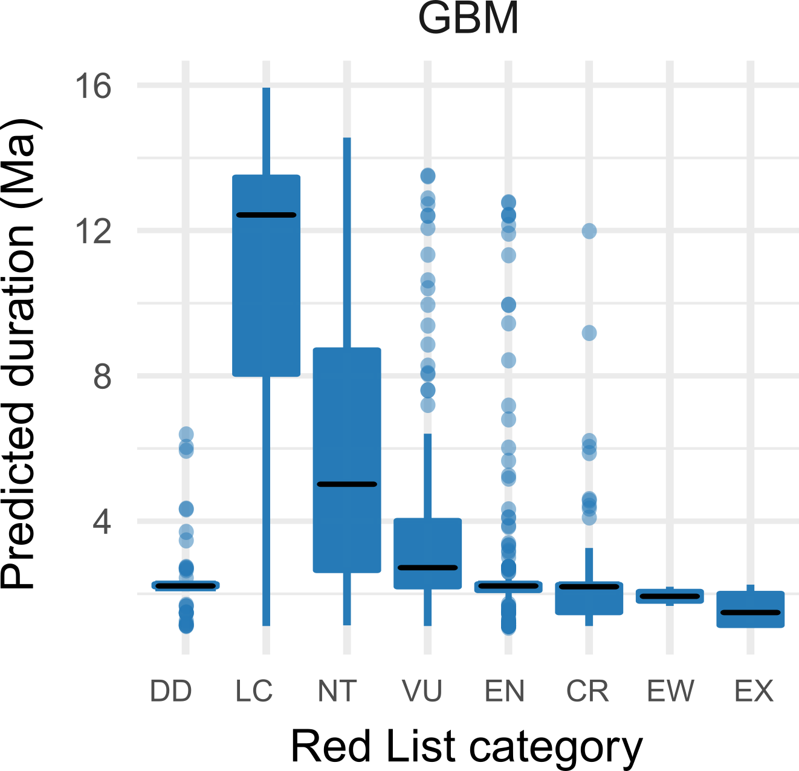
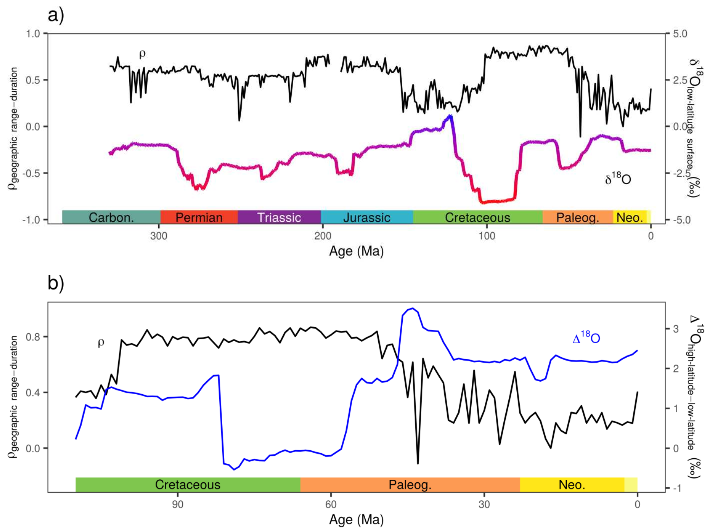
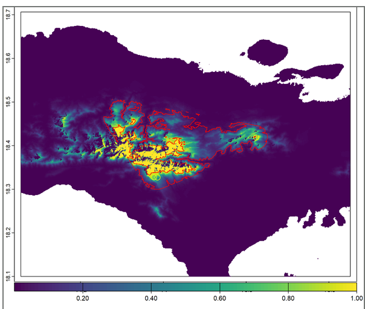

# CURRENT PROJECTS
[{ width=100px }](https://petrkeil.github.io/funding/post/2023/01/01/BEAST.html)

Since January 2025 I am at CZU in Prague working with [Petr Keils lab](https://petrkeil.github.io/funding/post/2023/01/01/BEAST.html) on temporal biodiversity changes and their drivers. 

  

**Large-scale co-occurrence dynamics in bird assemblages**

  

A major pattern in biodiversity change is that species turnover is more
pronounced than changes in species richness (Blowes et al., 2019; Dornelas et
al., 2014). Species turnover has many facets though, and changes in spatial
association have rarely been studied. This project analyses bird co-occurrence
changes from Europe, New York State, New Zealand, and Czech Republic over 30
years.

//> Currently resubmitted to Nature after peer review.

**Spatiotemporal range dynamics in birds**

  

Changes in species ranges happen via four processes: Persistence, Absence,
Colonization and Extinction. We use occupancy probability maps in a PCA
framework to identify common patterns in these four processes and compare those
patterns to species characteristics.

  

-----------

# PAST PROJECTS
## Global patterns of plant diversity and diversification 

During my time in Aarhus, I worked on global patterns of plant diversity and diversifcation. Tropical rainforests harbour about half of the world's terrestrial species on less than 10% of the world's land surface. Why? [Read more on the lab webpage](https://bio.au.dk/en/research/research-areas/genetics-and-evolution/plant-evolution-and-biodiversity).

Among other things, I worked on evolutionary assembly of tropical rainforests.When and how frequently have extant tropical plant lineages colonised the tropics? We identify temporal changes of rates of TRF immigration and emigration.

  

 A simple Binary State Specific Speciation and Extinction (BiSSE) model

 

  

**Drivers of global plant diversity**

[Tietje et al. 2022, PNAS](https://www.pnas.org/doi/full/10.1073/pnas.2120662119)

We show the (lack of) interaction of plant diversity with diversification rates
and environmental variables in a structural equation model framework combining
data for 330.000 seed plant species.

**Global phylogenetic diversity hotspots**

 [Tietje et al. 2023, New Phytologist](https://doi.org/10.1111/nph.19151)

Global hotspots of plant PD and how PD scales with area compared to species
richness. We show the centers of phylogenetic diversity and differences in
scaling compared to species richness, and potential implications for
conservation questions.

-----------

## The amphibian fossil record and extinction risk questions
This is selected output from my [doctoral thesis (2018)](https://doi.org/10.18452/19728) at the Natural History Museum Berlin.

 

  

  
**Predicting extinction risk of living amphibians with the fossil record**

We show in a unique combination of fossil and neontological data and machine learning based models how the fossil record can predict the IUCN assessed extinction risk of living species. [Tietje & Rödel, Ecology Letters (2018)](https://doi.org/10.1111/ele.13080).

[Tietje &  Rödel 2018, Ecology Letters](https://doi.org/10.1111/ele.13080)

**Climate modulates impact of range size on extinction risk in deep time**

[Tietje, Rödel, Schobben 2020, Paleo3](https://doi.org/10.1016/j.palaeo.2019.109414).

The correlation of geographic range and duration of amphibian species changes over time, and is strongly connected to the global latitudinal temperature gradient. Our results suggest that climatic conditions modulate the importance of geographic range on extinction risk for amphibians in deep time.

-----------

# A new system to assess extinction risk
In a brief stay at Temple University in Philadelphia I worked intensely on species distribution model-based quantitative measures of extinction dates.

  

The manuscript is currently in review at PNAS Nexus.

