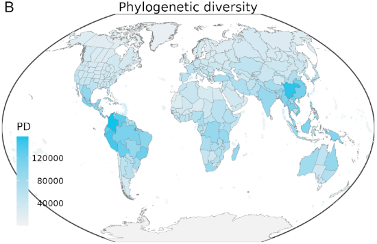

---
output:
  html_document:
    toc: no
    toc_depth: 2
    toc_float: yes
---

# Biodiversity changes over space, and time
Since January 2025, I am happy to be part of Petr Keils lab at the Czech University of Life Sciences (CZU) in Prague  working on the BEAST project, which is looking at temporal changes and their drivers of different biodiversity markers across space, time, and over different scales.
   Take a look here for the project description:  [{ width=100px }](https://petrkeil.github.io/funding/post/2023/01/01/BEAST.html)

 

## Large-scale co-occurrence dynamics in bird assemblages

The major finding of studies of biodiversity change is that changes in species composition are more pronounced than changes in species richness (Blowes et al., 2019; Dornelas et al., 2014). But species composition has many facets, and some of them still lack empirical assessment. 
What has rarely been studied is changes in spatial association, whether species have been moving closer to other species, or further apart, changing the perspective from per-site composition (e.g. beta diversity) to per-species composition (e.g. co-occurrence). In other words, we lack large-scale empirical assessments of temporal change of species co-occurrence patterns (Ulrich et al., 2017). 
This project analyses bird co-occurrence patterns from Europe, New York State, New Zealand, and Czech Republic over almost 50 years.

<!-- <a href = ""> -->
  
<!-- </a> -->

 

# A new system to assess extinction risk
I have been working on this project at Temple University in Phildalephia in 2024, which involves species distribution model-based quantitative measures or extinction dates, pontentially providing an alternative to the current IUCN Red List assessment with new remote sensing techniques to identify Primary Forest and other landcover type changes in the past, present and future.  
The manuscript is currently in review.

 

# Tropical rainforest hyperdiversity
This is a project I was working on as a Postdoc at Aarhus University. Tropical rainforests harbour about half of the world's terrestrial species, despite covering less than 10% of the world's land surface. These numbers are not precise for various reasons, but it is clear that tropical rainforests are outstandingly ("hyper"-)diverse. [Read more on the lab webpage](https://bio.au.dk/en/research/research-areas/genetics-and-evolution/plant-evolution-and-biodiversity).

 

## Evolutionary assembly of tropical rainforests

In this project, we look into when and how frequently extant tropical rainforest (TRF) plant lineages have colonised the biome. We aim at identifying temporal changes of rates of TRF immigration and emigration and connect them to environmental changes over millions of years. First results hint at immigration rates having only contributed little to TRF diversity.

<!-- <a href = ""> -->
  
      <!-- 

<!-- </a> -->

This ongoing work in progress and on the "to-publish"-pile.

 

## Global phylogenetic diversity hotspots

Global hotspots of plant PD and how PD scales with area compared to species richness. 

 [Tietje et al. 2023, New Phytologist](https://doi.org/10.1111/nph.19151)

 

## The drivers of global plant diversity

What drives global plant biodiversity? We show the interaction of plant diversity with diversification rates and environmental variables in a structural equation model framework combining data for 330.000 seed plant species.

<a href = "https://doi.org/10.1073/pnas.2120662119">
  
      <!-- 

          
</a>

[Tietje et al. 2022, PNAS](https://www.pnas.org/doi/full/10.1073/pnas.2120662119)

<!-- 
 -->
<!--   -->
<!-- 
 -->

<!-- 
 -->
<!-- Global maps for species richness (A) and diversification rates (mean root distance, B) [Tietje et al. (2022), Fig 1](https://www.pnas.org/doi/full/10.1073/pnas.2120662119). -->
<!-- 
 -->

 

---------------------------------------------------

# The amphibian fossil record and modern extinction risk

<a href = "https://doi.org/10.18452/19728">
  
      <!-- 

          
</a>

[Link to dissertation (2018)](https://doi.org/10.18452/19728)

My PhD thesis bridged paleobiology and conservation-motivated questions. Using the amphibian fossil record, I explored the influences of habitat types on extinction risk, the evaluation of modern day amphibians IUCN assessed extinction risk using the fossil record, and temporal variations in the influence of geographic range size on extinction risk.

 

## Temporal patterns in extinction risk factors and climate in the amphibian fossil record
The correlation of geographic range and duration of amphibian species changes over time, and is strongly connected to the global latitudinal temperature gradient. Our results suggest that climatic conditions influence the importance of geographic range on extinction risk for amphibians.

The results are published in [Paleo3](https://doi.org/10.1016/j.palaeo.2019.109414).

<!-- ### Literature -->

<!-- 1. Warren, R., et al. "Quantifying the benefit of early climate change mitigation in avoiding biodiversity loss."  -->
<!-- Nature Climate Change 3.7 (2013): 678‐682.  -->
<!-- 2. Stuart, S. N., et al. "Status and trends of amphibian declines and extinctions worldwide." Science 306.5702  -->
<!-- (2004): 1783‐1786.  -->
<!-- 3. Tietje, M., Rödel, M. O., & Schobben, M. (2020). The effect of geographic range and climate on extinction risk in the deep-time amphibian fossil record. Palaeogeography, Palaeoclimatology, Palaeoecology, 537, 109414. -->
<!-- 3. Tietje, M., Rödel, M.-O., Schobben, M. (2020). The effect of geographic range and climate on extinction risk in the deep-time amphibian fossil record. [Palaeogeography, Palaeoclimatology, Palaeoecology.](https://doi.org/10.1016/j.palaeo.2019.109414) -->

 

## Predicting extinction risk of living amphibians with the fossil record

We were able to show in a unique combination of fossil and neontological data and machine learning based models how the fossil record can predict the IUCN assessed extinction risk of living species. The results are published in Ecology Letters [Tietje, M. and Rödel, M. O. (2018), figure 1](https://doi.org/10.1111/ele.13080).

<!-- 
 -->
<!--   
 -->
<!--      -->
<!--   
 -->

<!--   
 -->
<!--      -->
<!--     
 -->
<!-- 
 -->
  
<!--  
<!-- 
 -->
<!--   -->
<!-- 
 

Model framework for the study. [Tietje, M. and Rödel, M. O. (2018), figure 1](https://doi.org/10.1111/ele.13080).

 -->

<!-- 
 -->
<!--   -->
<!-- 
 -->

Predicted durations in million years for living amphibian species, based on the model fitted with paleontological data. [Tietje, M. and Rödel, M. O. (2018), figure 3](https://doi.org/10.1111/ele.13080).

