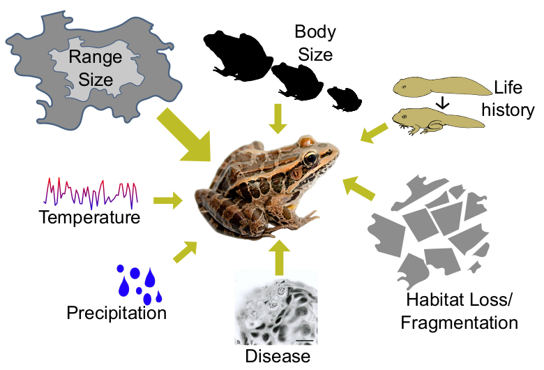

---
output:
  html_document:
    toc: no
    toc_depth: 2
    toc_float: yes
---

# A new system to assess extinction risk
This is my current work at Temple University since February 2024, not much to show yet. Ongoing work includes diving into species distribution models and global patterns of extinction risk according to IUCN Red List assessment in Primary Forest and other habitat types.

 

# Tropical rainforest hyperdiversity
Tropical rainforests are widely regarded to harbour about half of the world's terrestrial species, despite covering less than 10% of the world's land surface. These numbers are not precise for various reasons, but it is clear that tropical rainforests are outstandingly ("hyper"-)diverse. [Read more about the project on our lab webpage](https://peb-group.net/trf).

 

## Evolutionary assembly of tropical rainforests

In this project, we look into when and how frequently extant tropical rainforest (TRF) plant lineages have colonised the biome. We aim at identifying temporal changes of rates of TRF immigration and emigration and connect them to environmental changes over millions of years. First results hint at immigration rates having only contributed little to TRF diversity.

<a href = "">
  
      <!-- 

</a>

This is still work in progress and on the "to-publish"-pile.

 

## Global phylogenetic diversity hotspots

Global hotspots of plant PD and how PD scales with area compared to species richness. 

<a href = "">
  
      <!-- 

</a>

  [Tietje et al., New Phytol.](https://doi.org/10.1111/nph.19151)

 

## The drivers of global plant diversity

We show the interaction of global seed plant diversity, diversification rates, and environmental variables in a comprehensive framework combining data for 330.000 seed plant species.

<a href = "https://doi.org/10.1073/pnas.2120662119">
  
      <!-- 

          
</a>

Read the paper here: [Tietje et al. 2022, PNAS](https://www.pnas.org/doi/full/10.1073/pnas.2120662119)

<!-- 
 -->
<!--   -->
<!-- 
 -->

<!-- 
 -->
<!-- Global maps for species richness (A) and diversification rates (mean root distance, B) [Tietje et al. (2022), Fig 1](https://www.pnas.org/doi/full/10.1073/pnas.2120662119). -->
<!-- 
 -->

 

---------------------------------------------------

# The amphibian fossil record and modern extinction risk

<a href = "https://doi.org/10.18452/19728">
  
      <!-- 

          
</a>

[Dissertation (2018)](https://www.pnas.org/doi/full/10.1073/pnas.2120662119)

My PhD thesis looked into bridging paleobiology with conservation-motivated questions. Using the amphibian fossil record, I looked into the influences of habitat types on extinction risk, the evaluation of modern day amphibians IUCN assessed extinction risk using the fossil record, and temporal variations in the influence of geographic range size on extinction risk.

 

## Temporal patterns in extinction risk factors and climate in the amphibian fossil record
The correlation of geographic range and duration of amphibian species changes over time, and is strongly connected to the global latitudinal temperature gradient. Our results suggest that climatic conditions influence the importance of geographic range on extinction risk for amphibians.

The results are published in [Paleo3](https://doi.org/10.1016/j.palaeo.2019.109414).

<!-- ### Literature -->

<!-- 1. Warren, R., et al. "Quantifying the benefit of early climate change mitigation in avoiding biodiversity loss."  -->
<!-- Nature Climate Change 3.7 (2013): 678‐682.  -->
<!-- 2. Stuart, S. N., et al. "Status and trends of amphibian declines and extinctions worldwide." Science 306.5702  -->
<!-- (2004): 1783‐1786.  -->
<!-- 3. Tietje, M., Rödel, M. O., & Schobben, M. (2020). The effect of geographic range and climate on extinction risk in the deep-time amphibian fossil record. Palaeogeography, Palaeoclimatology, Palaeoecology, 537, 109414. -->
<!-- 3. Tietje, M., Rödel, M.-O., Schobben, M. (2020). The effect of geographic range and climate on extinction risk in the deep-time amphibian fossil record. [Palaeogeography, Palaeoclimatology, Palaeoecology.](https://doi.org/10.1016/j.palaeo.2019.109414) -->

 

## Predicting extinction risk of living amphibians with the fossil record

We were able to show in a unique combination of fossil and neontological data and machine learning based models how the fossil record can predict the IUCN assessed extinction risk of living species. The results are published in Ecology Letters [Tietje, M. and Rödel, M. O. (2018), figure 1](https://doi.org/10.1111/ele.13080).

<!-- 
 -->
<!--   
 -->
<!--      -->
<!--   
 -->

<!--   
 -->
<!--      -->
<!--     
 -->
<!-- 
 -->
  
<!--  
<!-- 
 -->
<!--   -->
<!-- 
 

Model framework for the study. [Tietje, M. and Rödel, M. O. (2018), figure 1](https://doi.org/10.1111/ele.13080).

 -->

<!-- 
 -->
<!--   -->
<!-- 
 -->

Predicted durations in million years for living amphibian species, based on the model fitted with paleontological data. [Tietje, M. and Rödel, M. O. (2018), figure 3](https://doi.org/10.1111/ele.13080).

